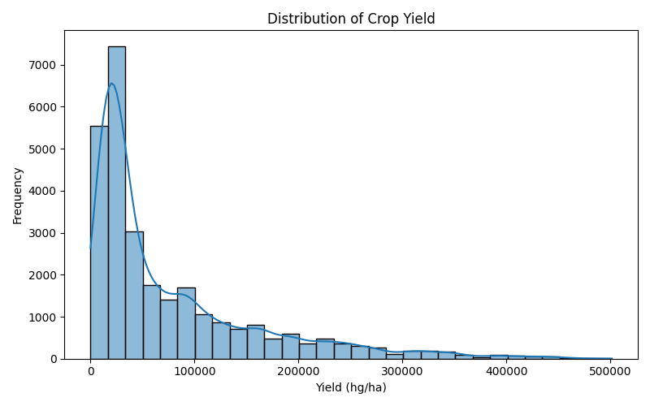
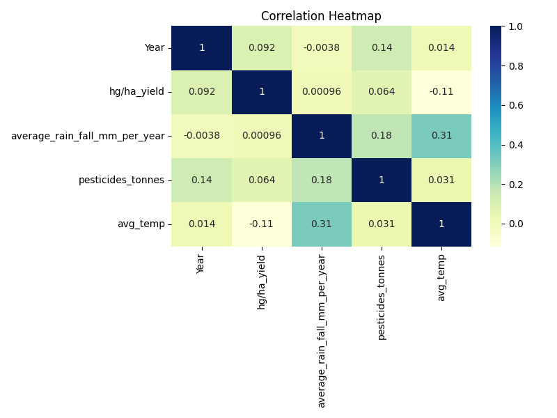
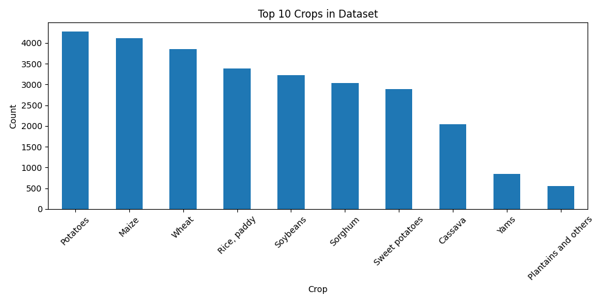
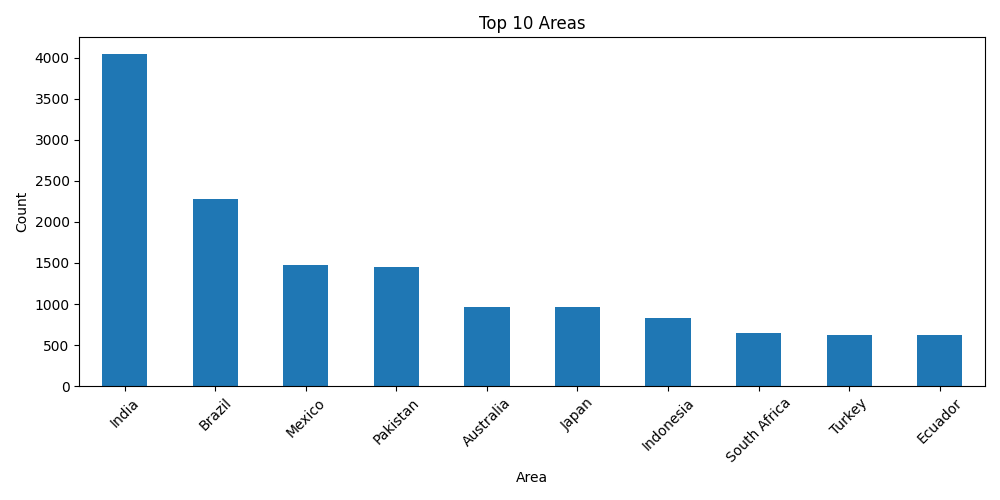
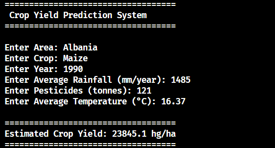

# 🌾 Crop Yield Prediction System using Machine Learning

## 📌 Project Overview

This project predicts crop yield using Machine Learning based on agricultural and environmental factors. It helps estimate crop production by analyzing features such as area, crop type, year, rainfall, pesticide usage, and average temperature.

## ✨ Features

- Data preprocessing and cleaning
- Exploratory Data Analysis (EDA)
- Label Encoding for categorical features
- Multiple Regression Models
- Model Performance Comparison
- Model Saving using Joblib
- Crop Yield Prediction Application

---

## 📂 Dataset

- **Source:** Kaggle
- **File:** yield_df.csv
- **Records:** 28,242
- **Features:** 6 Input Features + 1 Target Variable

### Features

- Area
- Item (Crop)
- Year
- Average Rainfall (mm/year)
- Pesticides (tonnes)
- Average Temperature (°C)

### Target

- Crop Yield (hg/ha)

---

## 📊 Exploratory Data Analysis (EDA)

The following visualizations were performed:

- Crop Yield Distribution
- Correlation Heatmap
- Top 10 Crops
- Top 10 Areas

### Visualizations

#### Crop Yield Distribution



#### Correlation Heatmap



#### Top 10 Crops



#### Top 10 Areas



---

## 🤖 Machine Learning Models Used

Machine learning models were implemented using the Scikit-learn library and evaluated using R² Score, MAE, and RMSE.

- Linear Regression
- Random Forest Regressor
- Gradient Boosting Regressor

---

## 📈 Model Performance

Machine learning models were evaluated using **R² Score**, **Mean Absolute Error (MAE)**, and **Root Mean Squared Error (RMSE)**.

| Model | R² Score | MAE | RMSE |
|--------|---------:|------------:|------------:|
| Linear Regression | 0.0843 | 62444.3106 | 81501.7645 |
| Random Forest Regressor | **0.9719** | **7767.9224** | **14267.7319** |
| Gradient Boosting Regressor | 0.8333 | 21805.2628 | 34773.8226 |

🏆 **Best Model:** Random Forest Regressor

---

## 🛠 Technologies Used

## 📦 Python Libraries

Install all required libraries using:

```bash
pip install -r requirements.txt
```

The project uses the following libraries:

- pandas
- numpy
- matplotlib
- seaborn
- scikit-learn
- joblib

---

## 📁 Project Structure

```
Crop-Yield-Prediction-System
│
├── dataset
├── images
├── models
├── app.py
├── crop_yield_prediction.py
├── README.md
└── requirements.txt
```

---

## ▶️ How to Run

1. Clone the repository

```bash
git clone https://github.com/sumit-dhakadd/Crop-Yield-Prediction-System.git
```

2. Install dependencies

```bash
pip install -r requirements.txt
```

3. Train the model

```bash
python crop_yield_prediction.py
```

4. Run the application

```bash
python app.py
```

---

## 📷 Project Output

The application predicts crop yield based on user inputs.

### Prediction Output



---

## 🚀 Future Improvements

The following enhancements can be added in future versions of this project:

- Deploy the model using Flask or Streamlit
- Build a responsive web interface
- Predict yield for multiple crops simultaneously
- Integrate real-time weather data
- Improve model accuracy using hyperparameter tuning
- Add support for new agricultural datasets
- Deploy the application on cloud platforms

---
## 👩‍💻 Author

**Sumit Dhakar**